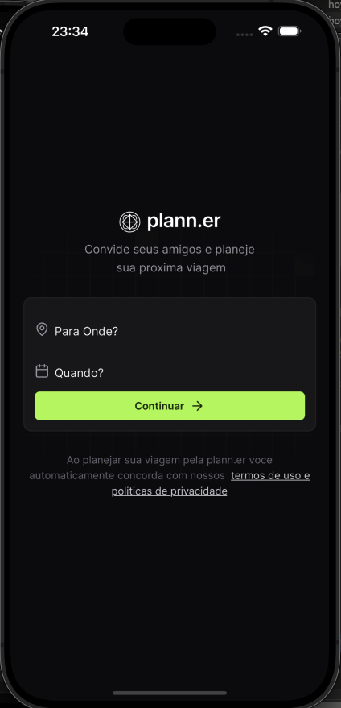

<!--
*** Thanks for checking out the Best-README-Template. If you have a suggestion
*** that would make this better, please fork the repo and create a pull request
*** or simply open an issue with the tag "enhancement".
*** Thanks again! Now go create something AMAZING! :D
-->


<!-- PROJECT SHIELDS -->
<!--
*** I'm using markdown "reference style" links for readability.
*** Reference links are enclosed in brackets [ ] instead of parentheses ( ).
*** See the bottom of this document for the declaration of the reference variables
*** for contributors-url, forks-url, etc. This is an optional, concise syntax you may use.
*** https://www.markdownguide.org/basic-syntax/#reference-style-links
-->
[![Contributors][contributors-shield]][contributors-url]
[![Forks][forks-shield]][forks-url]
[![Stargazers][stars-shield]][stars-url]
[![Issues][issues-shield]][issues-url]
[![MIT License][license-shield]][license-url]
[![LinkedIn][linkedin-shield]][linkedin-url]


<!-- PROJECT LOGO -->
<br />
<p align="center">
  <a href="https://github.com/correa96cl/nlw_journey_react_native">
    
  </a>

  <h3 align="center">NLW Journey 2024 React Native</h3>

  <p align="center">
    Impact readme of NLW Setup's projects with Node JS, React and React native
        <br />
    <a href="https://github.com/correa96cl/nlw_journey_react_native"><strong>Explore the docs »</strong></a>
    <br />
    <br />
    <a href="https://github.com/correa96cl/nlw_journey_react_native">View Demo</a>
    ·
    <a href="https://github.com/correa96cl/nlw_journey_react_native/issues">Report Bug</a>
    ·
    <a href="https://github.com/correa96cl/nlw_journey_react_native/issues">Request Feature</a>
  </p>
</p>


<!-- TABLE OF CONTENTS -->
<details open="open">
  <summary>Table of Contents</summary>
  <ol>
    <li>
      <a href="#about-the-project">About The Project</a>
      <ul>
        <li><a href="#built-with">Built With</a></li>
      </ul>
    </li>
    <li>
      <a href="#getting-started">Getting Started</a>
      <ul>
        <li><a href="#prerequisites">Prerequisites</a></li>
        <li><a href="#installation">Installation</a></li>
      </ul>
    </li>
    <li><a href="#usage">Usage</a></li>
    <li><a href="#roadmap">Roadmap</a></li>
    <li><a href="#contributing">Contributing</a></li>
    <li><a href="#license">License</a></li>
    <li><a href="#contact">Contact</a></li>
    <li><a href="#acknowledgements">Acknowledgements</a></li>
  </ol>
</details>


<!-- ABOUT THE PROJECT -->
## About The Project

[![Product Name Screen Shot][product-screenshot]](https://example.com)

The complete project of NLW Setup 2023 da Rocketseat (www.rocketseat.com.br)

Here's why:
* Your time should be focused on creating something amazing. A project that solves a problem and helps others
* You shouldn't be doing the same tasks over and over like creating a README from scratch
* You should element DRY principles to the rest of your life :smile:

Of course, no one template will serve all projects since your needs may be different. So I'll be adding more in the near future. You may also suggest changes by forking this repo and creating a pull request or opening an issue. Thanks to all the people have have contributed to expanding this template!

A list of commonly used resources that I find helpful are listed in the acknowledgements.

### Built With

This section should list any major frameworks that you built your project using. Leave any add-ons/plugins for the acknowledgements section. Here are a few examples.
* [Node JS](https://nodejs.org/es/)
* [React](https://reactjs.org)
* [React Native](https://reactnative.dev)


<!-- GETTING STARTED -->
## Getting Started

This is an example of how you may give instructions on setting up your project locally.
To get a local copy up and running follow these simple example steps.

### Prerequisites

This is an example of how to list things you need to use the software and how to install them.

```

### Installation Backend Project

1. Clone the repo
   ```sh
        git clone https://github.com/correa96cl/nlw-setup.git
   ```
2. Install all the libraries
```sh
   npm install
``` 
3. Execute App
```sh
    npm run dev
```

### Setup Web Project

1. Clone the repo
   ```sh
        git clone https://github.com/correa96cl/nlw_journey_react_native.git
   ```
2. Install the libraries
  ```sh
  npm i
  ```
3. Execute App
  ```sh
  npm run dev
  ```

### Setup Mobile Project

1. Clone the repo
   ```sh
        git clone https://github.com/correa96cl/nlw_journey_react_native.git
   ```

2. install the libraries
    ```
    sh
    npm i
    ```

3. Execute App
  ```sh
  npx expo start
  ```

3.1. Execute App clean the cache
    ```
    sh
    npx expo start --clean
    ```

9. Install Types UUID v4
  ```sh
    npm i @types/uuid -D
  ```


<!-- USAGE EXAMPLES -->
## Usage

Use this space to show useful examples of how a project can be used. Additional screenshots, code examples and demos work well in this space. You may also link to more resources.

_For more examples, please refer to the [Documentation](https://example.com)_


<!-- ROADMAP -->
## Roadmap

See the [open issues](https://github.com/correa96cl/nlw_journey_react_native/issues) for a list of proposed features (and known issues).


<!-- CONTRIBUTING -->
## Contributing

Contributions are what make the open source community such an amazing place to be learn, inspire, and create. Any contributions you make are **greatly appreciated**.

1. Fork the Project
2. Create your Feature Branch (`git checkout -b feature/AmazingFeature`)
3. Commit your Changes (`git commit -m 'Add some AmazingFeature'`)
4. Push to the Branch (`git push origin feature/AmazingFeature`)
5. Open a Pull Request


<!-- LICENSE -->
## License

Distributed under the MIT License. See `LICENSE` for more information.


<!-- CONTACT -->
## Contact

Marcelo Valderrama Correa - correa96cl@hotmail.com

Project Link: [https://github.com/correa96cl/nlw_journey_react_native](https://github.com/correa96cl/nlw_journey_react_native)


<!-- ACKNOWLEDGEMENTS -->
## Acknowledgements
* [Expo](https://expo.dev) - Mobile Version
* [Axios](https://axios-http.com)
* [TailWindCss](https://tailwindcss.com)
* [Fastify](https://www.fastify.io)
* [Prisma](https://www.prisma.io/react-server-components)
* [Dayjs](https://day.js.org)
* [Mermaid-js](https://mermaid.js.org)
* [zod](https://zod.dev)
* [Typescript](https://www.typescriptlang.org)
* [PostCSS](https://postcss.org)
* [clsx](https://www.npmjs.com/package/clsx)
* [vite](https://vitejs.dev)
* [Google Fonts](https://fonts.google.com)


fpvkr


<!-- MARKDOWN LINKS & IMAGES -->
<!-- https://www.markdownguide.org/basic-syntax/#reference-style-links -->
[contributors-shield]: https://img.shields.io/github/contributors/othneildrew/Best-README-Template.svg?style=for-the-badge
[contributors-url]: https://github.com/correa96cl/nlw-setup/graphs/contributors
[forks-shield]: https://img.shields.io/github/forks/othneildrew/Best-README-Template.svg?style=for-the-badge
[forks-url]: https://github.com/correa96cl/nlw-setup/network/members
[stars-shield]: https://img.shields.io/github/stars/othneildrew/Best-README-Template.svg?style=for-the-badge
[stars-url]: https://github.com/correa96cl/nlw-setup/stargazers
[issues-shield]: https://img.shields.io/github/issues/othneildrew/Best-README-Template.svg?style=for-the-badge
[issues-url]: https://github.com/correa96cl/nlw-setup/issues
[license-shield]: https://img.shields.io/github/license/othneildrew/Best-README-Template.svg?style=for-the-badge
[license-url]: https://github.com/correa96cl/nlw-setup/blob/master/LICENSE.txt
[linkedin-shield]: https://img.shields.io/badge/-LinkedIn-black.svg?style=for-the-badge&logo=linkedin&colorB=555
[linkedin-url]: https://linkedin.com/in/correa96cl
[product-screenshot]: image/logoApp.png


git push --set-upstream origin sula3

# nlw_journey_react_native


git checkout -b aula2

git push -u origin aula2